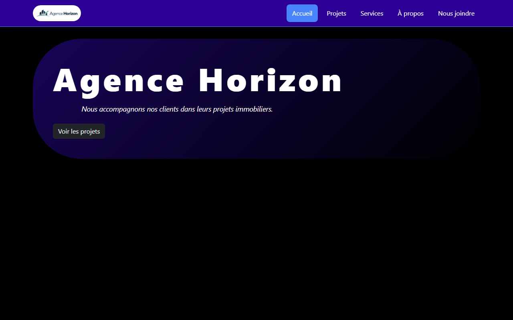

# Agence Horizon, TP1 Programmation avancée

**Auteur :** Guillermo Perez
**TP :** PA-TP1.

## Commandes pour lancer l'application

```bash
npm install
npm start
```

L'application démarre sur [http://localhost:3000](http://localhost:3000).

## Analyse des besoins (version finale)

### Fonctionnalités obligatoires

Le site doit permettre à l'utilisateur de :

- Naviguer entre les sections Accueil, Projets, Services, À propos et Nous joindre.
- Consulter une présentation générale de l'agence et de ses activités.
- Consulter la liste des projets immobiliers disponibles.
- Consulter les informations essentielles de chaque projet.
- Filtrer les projets affichés selon un critère pertinent (le type de projet).
- Retirer un projet de la liste affichée.
- Contacter l'agence à partir de la section Nous joindre.

### Informations affichées

- Pour chaque projet : un identifiant, un titre, une ville, un type, un statut, une courte description, une information financière (prix) et une image.
- Une présentation générale de l'agence et de ses services offerts.
- Les coordonnées de l'agence (adresse, téléphone, courriel).

### Comportements attendus

- Le contenu change sans rechargement de la page lorsque l'utilisateur clique sur une section.
- Seuls les projets correspondant au filtre choisi restent affichés.
- Un message clair s'affiche lorsqu'aucun projet ne correspond au filtre choisi.
- Un projet disparaît immédiatement de la liste lorsqu'il est retiré.
- La section active et le filtre actif sont identifiables visuellement.

### Contraintes de qualité

- Mise en page claire et cohérente d'une section à l'autre.
- Apparence visuelle cohérente (couleurs, polices, espacement).
- Site lisible et utilisable sur différentes tailles d'écran (mobile à ordinateur).
- Retour visuel immédiat aux actions de l'utilisateur.

## Arbre des composants (version finale)

```
App (state: sectionActive)
├── NavBar (props: sectionActive, changerSection)
│   ├── LogoAgence
│   └── Menu (props: sectionActive, changerSection)
└── Contenu (props: sectionActive, changerSection)
    ├── Accueil (props: changerSection)
    ├── Projets (state: filtre, projets)
    │   └── ProjetCard x12 (props: projet, onRetirerProjet)
    ├── Services
    ├── APropos
    └── NousJoindre
```

## Description des composants principaux

- **App** : contient le state principal (`sectionActive`) et distribue les données aux enfants (`NavBar`, `Contenu`).
- **NavBar** : affiche le logo et le menu de navigation, gère le collapse mobile (bouton hamburger) via React-Bootstrap.
- **LogoAgence** : affiche le logo de l'agence.
- **Menu** : affiche les liens de navigation et indique visuellement la section active.
- **Contenu** : affiche la section active (Accueil, Projets, Services, À propos ou Nous joindre) par affichage conditionnel.
- **Accueil** : présente l'agence et propose un bouton pour naviguer vers la section Projets.
- **Projets** : gère le state de la liste de projets et du filtre actif, filtre les projets avec `filter()`, les affiche avec `map()` et gère leur retrait.
- **ProjetCard** : composant réutilisable qui affiche les informations d'un projet reçu par props, et déclenche son retrait via une fonction reçue par props.
- **Services** : présente les services offerts par l'agence.
- **APropos** : présente la mission de l'agence.
- **NousJoindre** : présente les coordonnées de l'agence.

## Capture d'écran



## Sources des images

- Les 12 images des projets immobiliers (`src/assets/projets/`) proviennent de [Unsplash](https://unsplash.com/).
